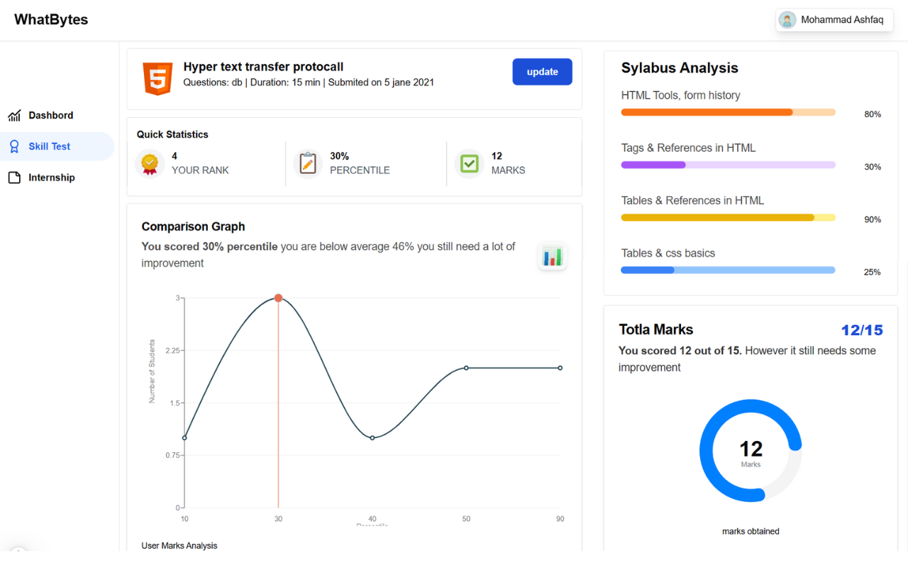
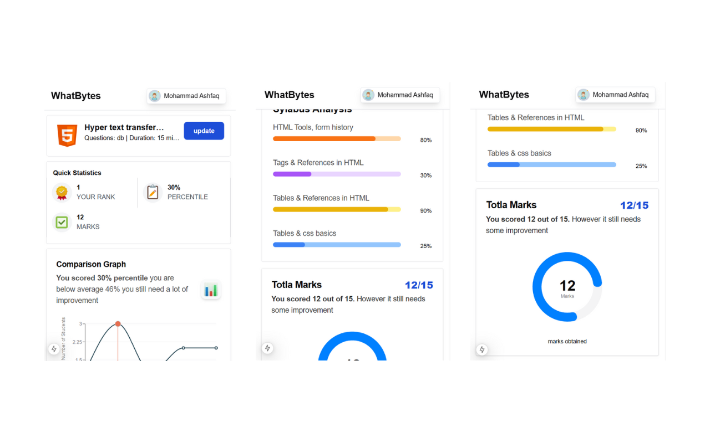
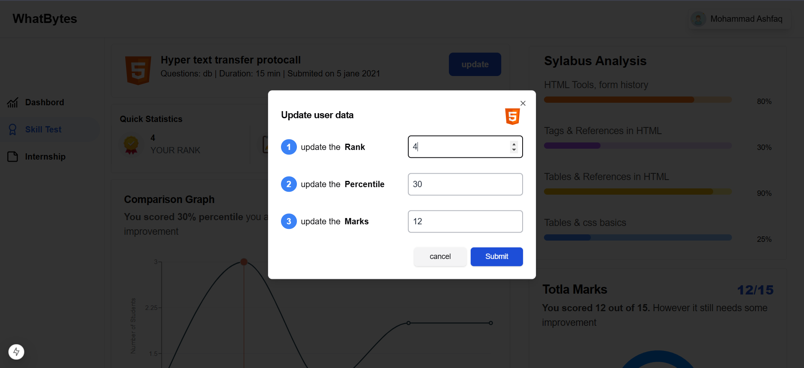

# Student Dashboard in NEXT.JS
All the requirements mentioned in the assignment are completed 

hear is the live website [link.](https://whatbytes-assignment-ki88.vercel.app/)







loom video about assignmen [link.](https://www.loom.com/share/000cadab1ba94539b863539ddc5053d0?sid=4188f4e3-927f-47bc-9b10-4de972c4d0c4)


## Running the project localy

First, run the development server:

```bash
npm run dev
# or
yarn dev
# or
pnpm dev
# or
bun dev
```

Open [http://localhost:3000](http://localhost:3000) with your browser to see the result.

You can start editing the page by modifying `app/page.tsx`. The page auto-updates as you edit the file.


